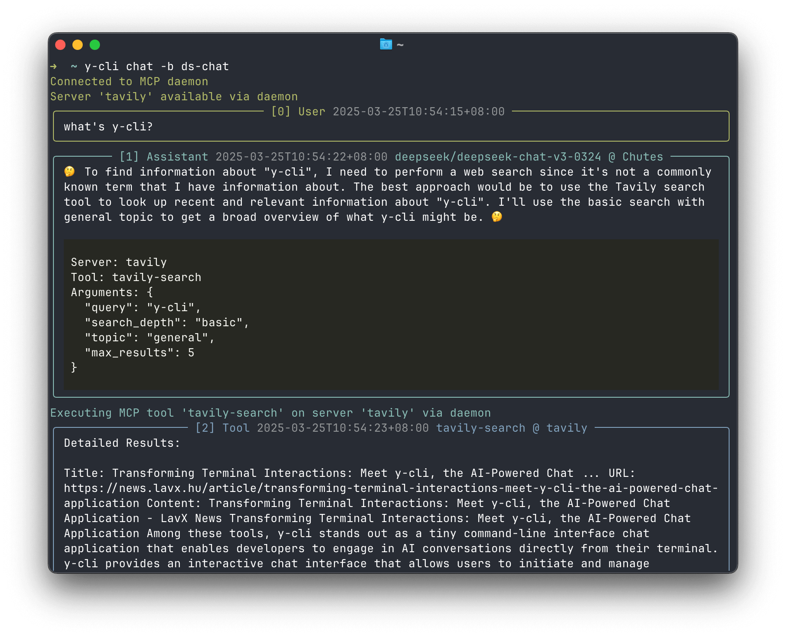

# y-cli 🚀

A tiny command-line interface chat application that brings AI conversations to your terminal.

Check out [y-gui](https://github.com/luohy15/y-gui) for a web-based version of y-cli.

## ✨ Features

- 📝 Flexible storage options:
  - Local JSONL files for easy access and sync
  - Cloudflare D1 for cloud storage
- 💬 Interactive chat interface with tool execution visualization
- 🤖 Support for multiple bot configurations (any base_url/api_key/model combination). Supported api format type:
  - [OpenAI chat completion streaming format](https://platform.openai.com/docs/api-reference/chat/streaming)
  - [Dify chat-messages streaming format](https://docs.dify.ai/guides/application-publishing/developing-with-apis)
- 🤔 Support for reasoning model
  - [Deepseek-r1 reasoning_content](https://api-docs.deepseek.com/guides/reasoning_model) output print
  - [OpenAI o3-mini reasoning_effort](https://platform.openai.com/docs/guides/reasoning) configuration 
- 🔗 MCP (Model Context Protocol) integration:
  - Client support with multiple server configurations (stdio/SSE)
  - Persistent daemon
  - Custom prompt configurations
- 🧐 Simple "Deep Research" mode by prompt configuration
  - [Demo](https://cdn.luohy15.com/chat/660831.html)

## Demo




[asciicast](https://asciinema.org/a/709735)

### Multiple bot configurations
```
➜  ~ y-cli bot list
Name         API Key      API Type    Base URL                             Model                                Print Speed    Description    OpenRouter Config    MCP Servers    Reasoning Effort
-----------  -----------  ----------  -----------------------------------  -----------------------------------  -------------  -------------  -------------------  -------------  ------------------
default      sk-or-v1...  N/A         https://gateway.ai.cloudflare.co...  google/gemini-2.0-flash-001          None            N/A            Yes                  No             N/A
claude       sk-or-v1...  N/A         https://gateway.ai.cloudflare.co...  anthropic/claude-3.7-sonnet:beta     None             N/A            Yes                  todo           N/A
o3-mini      sk-or-v1...  N/A         https://gateway.ai.cloudflare.co...  openai/o3-mini                       None             N/A            Yes                  No             low
ds-chat        sk-or-v1...  N/A         https://gateway.ai.cloudflare.co...  deepseek/deepseek-chat-v3-0324:free                 None            N/A            Yes                  tavily         N/A
dify-bot     app-2drF...  dify        https://api.dify.ai/v1                                                    None             N/A            No                   No             N/A
```

### Multiple MCP servers
```
➜  ~ y-cli mcp list
Name            Type    Command/URL          Arguments/Token    Environment     Auto-Confirm
--------------  ------  -------------------  -----------------  --------------  --------------
brave-search    sse     https://router.m...                                     brave_web_s...
todo            stdio   uvx                  mcp-todo
exa-mcp-server  stdio   npx                  exa-mcp-server     EXA_API_KEY...
```

## ⚡ Quick Start

### Prerequisites

Required:
1. uv
2. OpenRouter API key

Setup Instructions:
1. **uv**
   - Follow the [official installation guide](https://docs.astral.sh/uv/getting-started/installation/)
   - uv will automatically manage Python installation

2. **OpenRouter API key**
   - Visit [OpenRouter Settings](https://openrouter.ai/settings/keys)
   - Create a new API key
   - Save it for the initialization step

### Run without Installation
```bash
uvx y-cli
```

### Install with uv tool
```bash
uv tool install y-cli
```

### Initialize
```bash
y-cli init
```

### Start Chat
```bash
y-cli chat
```

## 🛠️ Usage

```bash
y-cli [OPTIONS] COMMAND [ARGS]...
```

### Commands
- `chat`   Start a new chat conversation or continue an existing one
- `list`   List chat conversations with optional filtering
- `share`  Share a chat conversation by generating a shareable link
- `import` Import chats from an external file (useful for storage migration)
- `bot`    Manage bot configurations:
  - `add`     Add a new bot configuration
  - `list`    List all configured bots
  - `delete`  Delete a bot configuration
- `mcp`    Manage MCP server configurations:
  - `add`     Add a new MCP server configuration
  - `list`    List all configured MCP servers
  - `delete`  Delete an MCP server configuration
- `daemon`  Manage the MCP daemon:
  - `start`    Start the MCP daemon
  - `stop`     Stop the MCP daemon
  - `status`   Check daemon status
  - `log`      View daemon logs
  - `restart`  Restart the daemon
- `prompt` Manage prompt configurations:
  - `add`     Add a new prompt configuration
  - `list`    List all configured prompts
  - `delete`  Delete a prompt configuration

### Options
- `--help`  Show help message and exit

## 📚 Documentation

Visit the [deepwiki page](https://deepwiki.com/luohy15/y-cli) for comprehensive project documentation and guides.
